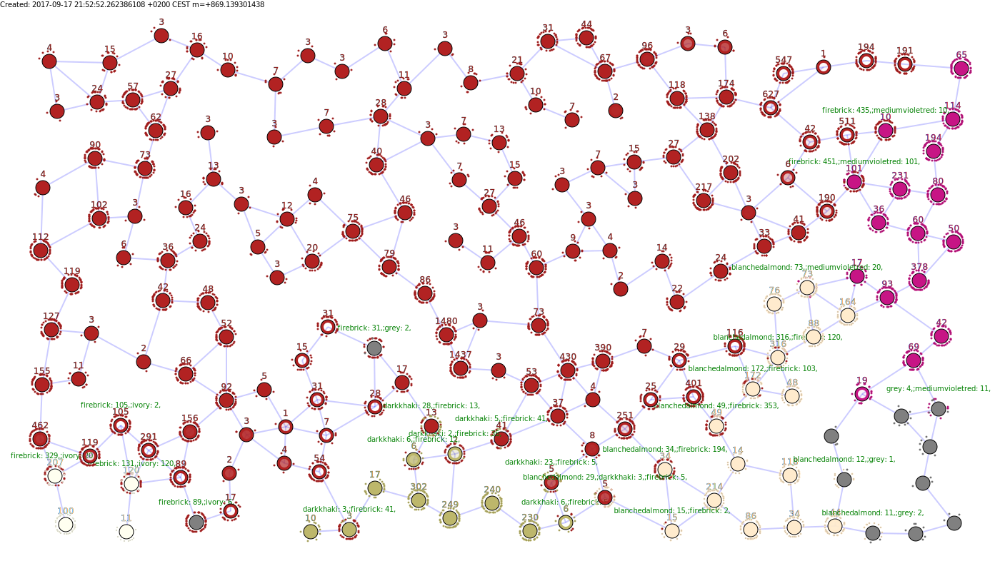

# RiseAndFallOfEmpires
Simple star strategy game to experiment with new technologies.

# install
Install (golang)[https://golang.org/].
Copy this repository via `go get -u github.com/eqinox76/RiseAndFallOfEmpires`
This project uses the (govendor)[https://github.com/kardianos/govendor] library for dependency management. Install it via `go get -u github.com/kardianos/govendor` 

# Progress
First game that a ai actually won:

# Thanks to
 https://github.com/gogo/protobuf
 https://github.com/kardianos/govendor
